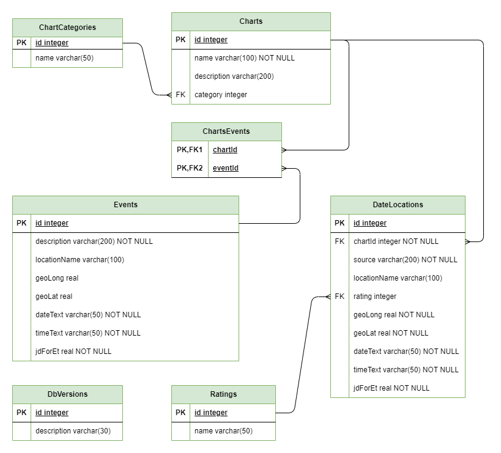

# Developers Documentation Enigma Research

## Version 0.3

## Enigma Research - introduction

[TOC]

Enigma Suite is a software suite, written in C#. The program is free and open source. This document provides some information for interested programmers. In future releases, I hope to augment this document.

Please read the User Manual for information about the functionality of Enigma Research.

I want to thank Gökhan Yu for convincing me to use C#. It was the right choice for building a Windows based astrology application. Gökhan also provided valuable insights into the technicalities of C# and .Net.

I also want to thank Cees Jansen for providing valuable insights on the use of randomness, which was important for the realization of control groups.

### License / open source

Enigma is Open Source. You can use it following the terms of the GNU General Public License (GPL). The GPL allows you to use, change and redistribute this software only if your own software is also open source. It does not have to be free, but the full source code should be publicly available. For more information, see the file *gpl-3.0.txt* in the source's root.

Enigma uses libraries from the Swiss Ephemeris (SE). For the SE, additional conditions are in place. These conditions prohibit the use of the software unless it is open source and also free. If you want to charge money for a program using software from the SE, you need to buy a professional license from the SE. For more information, see the file *se_license.htm* in the source's root.

To use software from Enigma in your program, that program has to be open source. If you include the libraries from the SE, it also has to be free. Buying a license from the SE does not change the condition from the GPL that the software should remain open source. If you want to create software that is not open source you can use the libraries from the SE but you will need to buy 
a professional license, and you cannot use any code from Enigma.

## Technical basics

### Development environment

#### IDE
I develop Enigma with _JetBrains Rider_. This IDE is not free, but you can try to apply for a free open source license. I am happy JetBrains accepted Enigma for such a free license :-) 
The code also works on MicroSoft Visual Studio (Community Edition).

#### Dependency injection
For dependency injection, Enigma uses the NuGet package *Micosoft.Extensions.DependencyInjection*.

#### MVVM
The UI uses the MVVM pattern. I implemented this with the NuGet package *Community.Toolkit.Mvvm* from Microsoft.

#### Material Design
Enigma uses some aspects from Material Design, via the NuGet package *MaterialDesignTheme*s.

#### Persistency
The database is a *SQLite* instance. As a minimal ORM, I use *Dapper*. Both are accessible via Nuget.

#### Logging
*Serilo*g takes care of the logging, you can find it in NuGet Serilog.Sinks.File.

#### Testing
Unit testing is done with *NUnit* (NuGet NUnit). For mocking I use *Moq* (NuGet Mock).

#### Documentation

I created the HTML version of the user manual with *Writ*erside from JetBrains. 

### Coding conventions

I will try to abide to the standards. 
For a definition check: https://docs.microsoft.com/en-us/dotnet/csharp/fundamentals/coding-style/coding-conventions .

### Architectural decisions

#### Windows based
Enigma works on Windows platforms. I will not attempt to support other platforms, at least not for the foreseeable future. 
The main reason is that being multi-platform requires much effort, even with the availability of solutions like Avalonia.
These efforts would be both in time and financial: supporting Apple hardware is difficult without buying it.

#### Using separated projects
The code of Enigma comprises 6 separate projects:
* **Frontend.Ui** : everything for the user interface.
* **Api** : API's that to access the backend.
* **Core** : code in the backend.
* **Facades** : facades that provide access to external systems (for now only the Swiss Ephemeris).
* **Domain**: domain definitions, accessible by both the frontend and backend.
* **Test**: All unit tests.

#### WPF for the frontend
The frontend uses WPF and XAML. I also considered Avalonia, which supports multiple environments and improves the XAML syntax. But Avalonia does not support as many NuGet packages as plain WPF does. It does not support the material design package, which was a no-go for me.

#### Frontend specifics
The frontend uses the MVVM pattern. Navigation between views in the frontend goes primarily via messaging.
The look-and-feel is loosely based on Material Design.

#### Separation of frontend and backend
The separation between the frontend and backend is very strict. All functionality from the backend is only accessible via a set of API's. 

#### Based on dependency injection
The backend uses dependency injection. The frontend uses some DI, but not consistently. 
Separate classes, that react on messages, handle the creation and termination of views.

#### Unit testing
I use NUnit for unit testing. I believe testing is very important though I am not religious about Test Driven Development.
Enigma does not yet support integration tests but I want to add that in a future release.

### Using the Swiss Ephemeris

For astronomical calculations, I use the Swiss Ephemeris (SE). The SE comprises a set of data and a 64-bits dll: *swedll64.dll*. I use the attribute [DllImport] to access the dll. All imports from the dll are defined in facades. 
As an example for the definitions I used the file swissdelphi.pas that Pierre Fontaine and others created to access 
the same dll from Delphi.

### Icons

All icons in Enigma, except the main icon that appears on the screen, are from the icon set by Google, used for 
Material Design. You can download the originals at https://fonts.google.com/icons .

## Installing the code

Clone the repository from GitHub: https://github.com/jankampherbeek/EnigmaSuite .

Copy swedll64.dll from Enigmasuite/Enigma/Enigma.Frontend.res to
Enigmasuite/Enigma/Enigma.Frontend/bin/Debug/net6.0-windows and to
Enigmasuite/Enigma/Enigma.Frontend/bin/Release/net6.0-windows

## Projects

Enigma is a .NET solution that contains 6 projects. There is a separate project for unit testing, the other 5 projects contain the application. There is only limited communication between these 6 projects.

#### Project Frontend.Ui

*Frontend.Ui* becomes active as the application starts. It takes care of some initializing. Its main task is showing information to the user and receiving input from the user.

#### Project API

The classes in this project receive requests from the Frontend, perform some basic validation, and pass the requests to 
a handler in the *Core.Handlers* project. In most cases, the API returns a response to the Frontend. 
An API contains no business logic.

#### Project Core.Handlers

A Handler orchestrates the fulfillment of a request. Possibly it uses some basic business logic but many times, but often it relies on helper classes. A handler may call other handlers. 
Sometimes it will simply pass through a request but it can also combine the results of several helper classes.

#### Project Facades

The project *Facades* contains classes that can access the outside world. A range of classes is used to access the dll from the Swiss Ephemeris. 

#### Project Domain

*Domain* contains all domain objects, including enums, DTO's and records. *Domain* cannot access other projects and is itself accessible by all projects.

## Astronomical aspects

I follow the usual approach using the Swiss Ephemeris, but I need to mention some specifics.

### School of Ram: hypothetical planets

Enigma supports the three hypothetical planets as proposed by the School of Ram: Persephone, Hermes and Demeter. 
The calculations are based on the orbital elements and calculated separately, without accessing the SE.

### School of Ram: oblique longitude

The School of Ram supports a solution for the projection of the solar system bodies to the ecliptic. This solution ensures a proper placing of bodies in a house. However, the projection to the ecliptic is skewed. The solution is called 'true place' and also 'astrological place'. I prefer the more correct term 'oblique longitude'. 

Enigma implements a dedicated calculation of this oblique longitude. 

## Research

### Control groups and random numbers

To create a control group, you need to calculate random values. The standard *PRNG* (Pseudo Random Number Generator) does not supply true random numbers.

Enigma uses *System.Security.Cryptography* from Microsoft, a *CSPRNG* (Cryptographic Secure Pseudo Random Number 
Generator). More information: 
[https://download.microsoft.com/download/1/c/9/1c9813b8-089c-4fef-b2ad-ad80e79403ba/Whitepaper%20-%20The%20Windows%2010%20random%20number%20generation%20infrastructure.pdf](https://download.microsoft.com/download/1/c/9/1c9813b8-089c-4fef-b2ad-ad80e79403ba/Whitepaper - The Windows 10 random number generation infrastructure.pdf)

This solution is sufficiently random to support the creation of control groups.

## Configuration
Enigma uses two configurations: a configuration for general use and an additional configuration for progressions. The system defines a standard configuration, and the user can change the configurations by defining deltas. Enigma uses these deltas to correct the standard configuration and define the actual configuration. 

The program saves the configuration as a dictionary. The key-value pairs in the dictionary use a predefined key and a value that can comprise multiple values, separated by two pipes (standing lines). It is not possible to use a single char as a separator as all characters are being used by the Enigma font. Using one character would interfere with the glyph for that character.

### Persistency of the general configuration

There are three groups of keys:
* _keys for chart points_, these are prefixed with <strong>CP_</strong>, followed by an index that refers to the enum for chartpoints.
* _keys for aspect types_, the prefix is <strong>AT_</strong>, followed by the index for the enum aspecttypes.
* *keys for aspect line colors*, the prefix is **AC_**, followed by the index for the enum aspecttypes.
* _all other keys_, no specific prefix. The key cannot start with one of the prefixes mentioned above.

The values for both chart points and aspects uses the following structure:

u||g||o||s

The values for colors only shows the full name of the color:

YellowGreen

* **u** means 'use', enter 'y' if the chart point or aspect type should be used, otherwise 'n'.

* **g** means 'glyph', enter the character or unicode for the glyph.

* **o** means 'orb percentage', enter a value of 100 or lower.

* **s** means 'show', enter 'y' if the chart point or aspect type should show in the graphic chart, otherwise 'n'. Enigma will support this in future releases.

  

An example: **y||a||100||y**  means: use this point or aspect, the glyph is 'a', the orb percentage is 100% and the chart drawing should show the point/aspect.

### Persistency of the configuration for progressions

The configuration supports three progressive techniques, each with a specific prefix:
* _transits_, the prefix is <strong>TR_</strong>.
* secondary directions_, the prefix is <strong>SC_</strong>.
* _symbolic directions_, with the prefix <strong>SM_</strong>

For each progressive technique, there is one orb, and an enumeration of supported chart points. There is also a time-key for symbolic directions.

* _orb:_ add <strong>ORB</strong> after the prefix of the progressive technique.
* _chart point:_, add the prefix for the chart point, as defined in the previous paragraph, to the prefix of the progressive technique.
* _time-key:_, add the prefix <strong>KEY</strong> after the prefix of the progressive technique. 

The values for the orb contain only a number. The values for the chartpoints have the following structure:
u||g

* **u** means 'use', enter 'y' if the chartpoint should be used, otherwise 'n'.
* **g** means 'glyph', enter the character or unicode for the glyph.

A few lines with keys and values as an example

"TR_ORB", "1.5"

"TR_KEY", 1

"TR_CP_0", "y||a"

The orb for transits is 1.5 degrees, and the key is 1 (one degree, refers to the enum SymbolicKeys).
For transits, the Sun is used and the glyph is 'a'.

## Database

The database for Enigma is a RDBMS, a standard relational database. 
It is implemented with SQLite and uses Dapper as ORM. Dapper allows for working with plain SQL.

### Data model

This image shows the most important tables, it ignores some simple lookup tables. 

## Work to do

Enigma is in beta. There is plenty of room for improvement. I intend to finish the following points before declaring Enigma production ready.

1. Adding more functionality. 
2. More testing:
   1. Improving the coverage for unit tests.
   2. Adding integration tests.
3. Code:
   1. Combining interfaces and implementations in the same file.
   2. Replacing several enums with lookup tables in the database.
   3. Solving most warnings.

