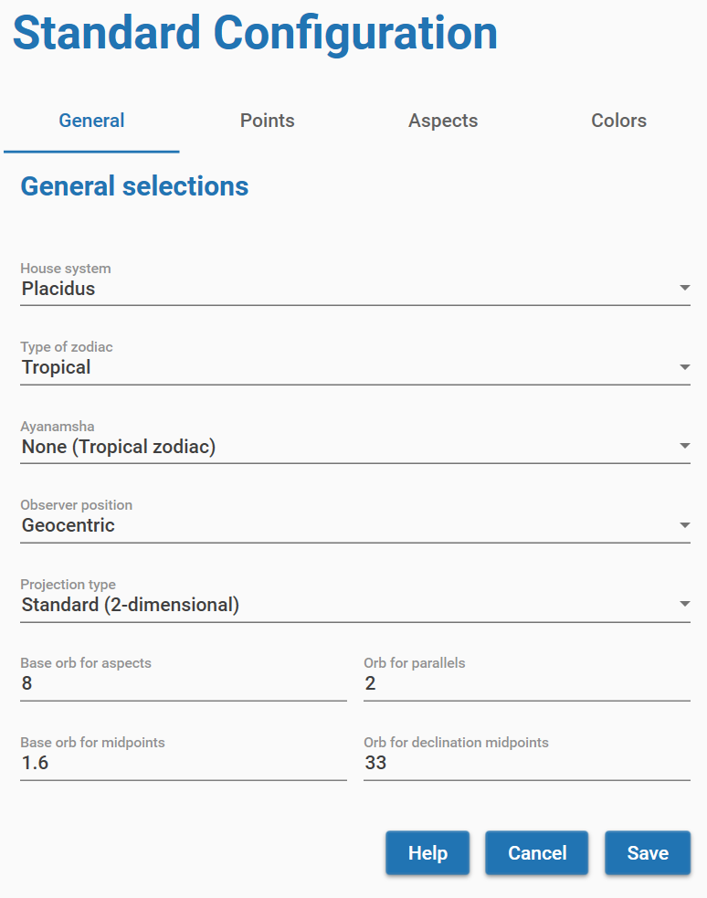
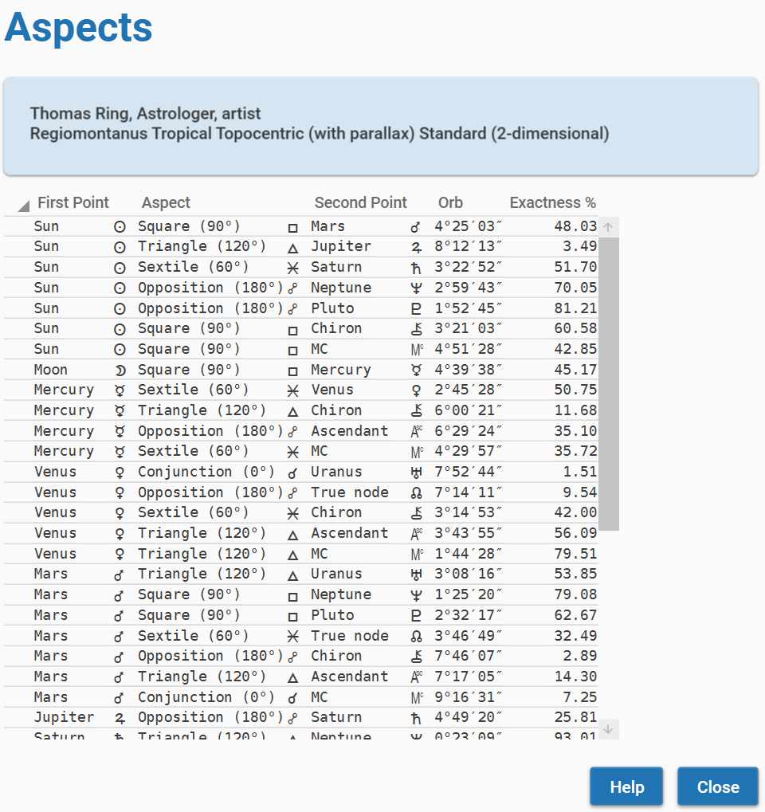
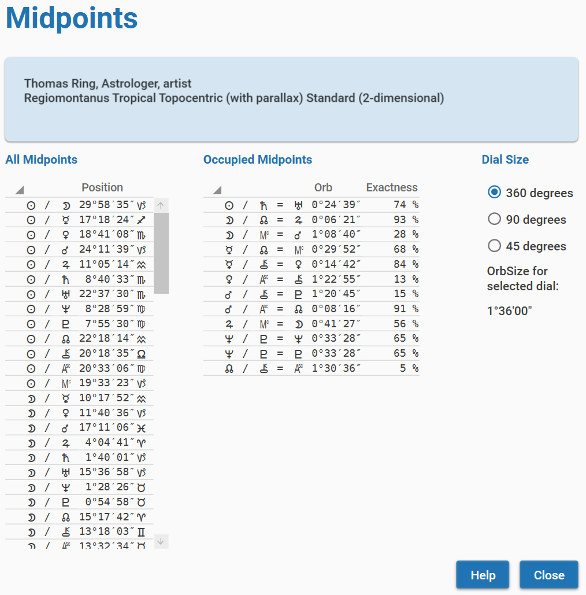
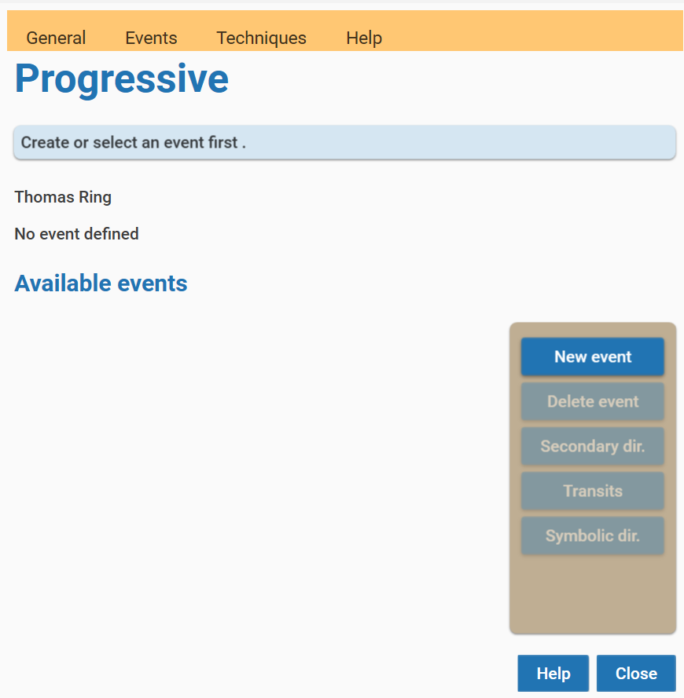
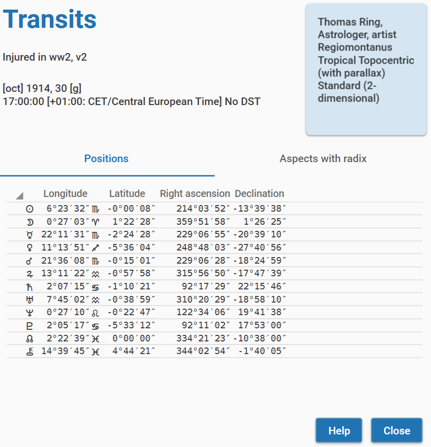
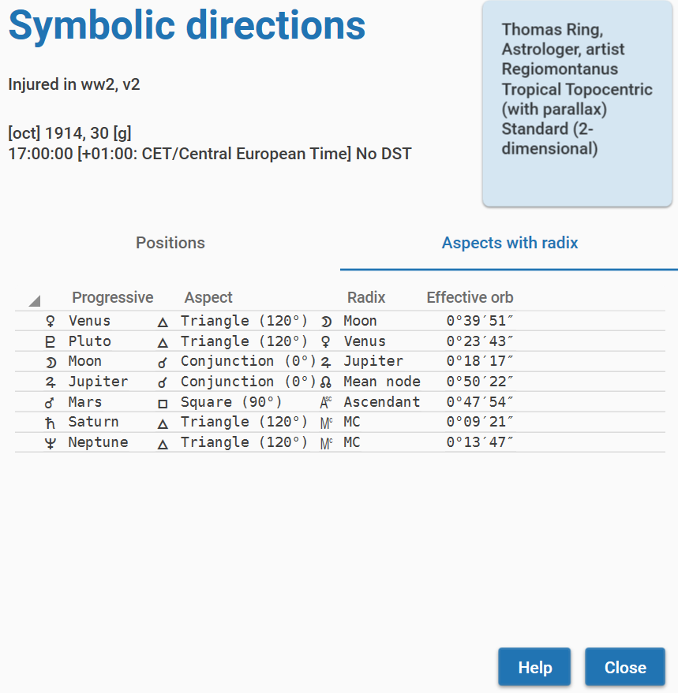
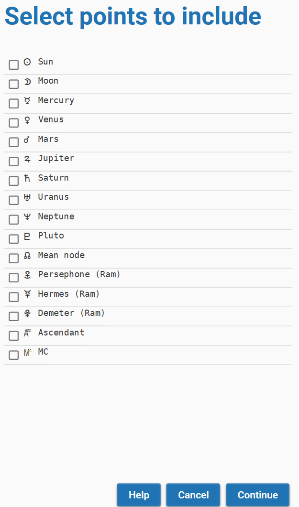
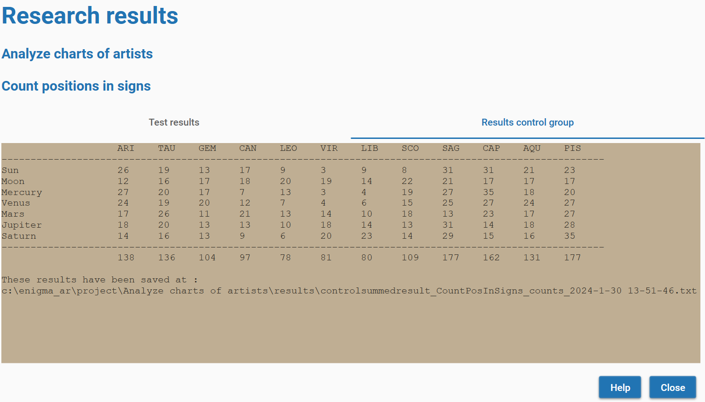

# User Manual Enigma Astrology Research - Release 0.2

[TOC]

## Introduction

Thank you for your interest in Enigma. 
You are about to learn about a program that calculates charts and also supports several types of research into astrology.

You can use it for your astrological calculations. Enigma is accurate and calculates fast. 
It will produce a chart wheel and perform the most important analysis.

The program also supports several types of research: counting aspects, occupied midpoints and more. 
And it generates control groups so that you can cancel out artifacts.

Several other releases will follow and each new release will add more functionality.

Enigma is free: you do not have to pay for it. 
And Enigma is open source: I published all code, and anybody can download it. 
Programmers that want to use my code can do so freely, but only if their own software is also open source.

I hope you enjoy the program!

Jan Kampherbeek.

### Parts of the user manual

This User Manual comprises the following parts:

- **Configuration** and settings. You can tailor Enigma to your own preferences.

- **Module Charts**. How to calculate and analyze a chart and how to use progressive techniques.

- **Module Research**. How to set up and perform research.

- **Appendix**. Specifications and background information.

### Related documents
- **Installation manual** which leads you through the installation process.
- **Release notes**, an overview of added functionality in this and previous releases.
- **Pogrammers manual**, a separate manual for those that are interested in the source code of Enigma.

## General information
Enigma consists of several modules, currently a module for charts and a module for research.
In future releases, I will add more modules.

### User assistance
Enigma tries to help you when using the program. 
It shows on-line help, checks your input, writes details to a log-file and prevents wrong results.

#### On-line help
In almost all windows, Enigma shows a button **Help**. 
If you click this button, the program shows specific information for the current window.
To prevent cluttering the screen with many windows, you need to close the help window before you can continue.

#### Input check
Where possible, Enigma checks your input. 
It checks for the correct format and range for date, time and geographical coordinates. 
It also checks if a date is valid and it takes leap years into account while doing so.

If you make an error, Enigma marks the entry with a red underlining. Just correct the input and click again.

Please note that you enter numbers with fractions based on the ‘locality’ (language and other settings) of your computer. 
If you normally use a dot to separate integer and fraction, you also need to use a dot in Enigma. 
The same if your computer expects a comma by default.

#### Log-files
Enigma writes information about its activities to log-files. 
These files are in the folder *c:\enigma_ar\logs*. Each day, the program starts a new log. 
If there are more than 31 log-files, the program deletes the oldest files. 
In case of an error, the log-files can contain important information about the error. 
I might ask you for these log-files if you report an error.

#### Preventing wrong results
Enigma supports almost 30,000 years of planetary calculations. 
But for some celestial points, this period is much shorter. 
Especially for Chiron, which you cannot calculate before 675 CE.

The Swiss Ephemeris, which takes care of all the calculations in Enigma, does not object if a planet is out of the 
supported range, it just returns a zero. 
This translates to zero Aries, and you could happily use this point and calculate aspects and midpoints. 
That makes little sense, so Enigma filters the results: if it cannot calculate a celestial point, it will just omit it.

### Starting Enigma

Click the Enigma icon to start the program.

You will see a window with two images, one labeled *Charts* and one labeled *Research*.

{width="400"}

Click an image to go to the corresponding module. 
If you finish working in a module, you will return to this start window and can make another selection.
Both modules of Enigma use the same configuration and the same settings.

The settings define the location of files that Enigma uses.
The configuration gives you the opportunity to define how Enigma behaves astrologically: 
which house system, which planets, aspects, and much more.

#### Checking for new releases
Enigma automatically checks for new releases. If a new release is available, it shows a message in the start window.

# Configuration and settings

## Settings

You can access *Settings* from both modules *Charts* and *Research* and check them,
but in this release of Enigma, you can not change anything.

Select the menu option **General - Settings**.
You will see a window with information about the location of the following files:

 {width="400"}

- **Data files**. This folder contains the data files you imported.

- The location of **Projects**. All projects will have a sub folder with the name of the project. These sub folders contain all data that is generated for this project.

- Enigma does not yet use **Exported files**. In the future, it will contain the results of exporting data.

- Enigma writes remarks to **Log files**. In case of an error, these log files will be helpful.

- The folder **Database** contains data for calculated charts.

## Standard configuration

You can check and change the configuration via the module *Charts* or via the module *Research*.
Select the menu option **General - Configuration**.

 {width="400"}

This will show a window with a wide range of configurable items. The window comprises 3 tabs:

- The tab **General** shows astronomical settings and settings for orbs. This tab is initially shown.

- **Points** shows the most planets and other points.

- **Aspects** shows all available aspects.

### General selections

If you select the tab *General* you can define the following preferences:

**House system**. Currently, Enigma supports only house systems with 12 houses. 
The default selection is Regiomontanus.
Select *None* if you do not want to use a house system.

**Type of zodiac**. Select either *sidereal* or *tropical*.
If you select tropical, the Ayanamsha will always be None.
If you select another Ayanamsha, the setting for Type of zodiac will automatically change into *sidereal*.

**Ayanamsha**. Select one of the available Ayanamshas.
In the paragraph *Appendix: Ayanamshas* you will find a brief explanation of the different possibilities.
See also the remarks at the point above: *Type of zodiac*.

**Observer position**. The standard approach is *topocentric*, so Enigma takes parallax into account.
If you do not want to use parallax correction, select *geocentric*.

**Projection type**. Select *Standard (two-dimensional)* for most approaches.
*Oblique longitude* provides an alternative calculation as supported by the School of Ram.
It is also called *True Astrological Longitude Location*.

**Base orb for aspects**. The base orb for aspects will be corrected with the percentages for celestial bodies and aspects.
See the paragraph *Appendix: Defining orbs*.
The value shows the maximum orb for the most important aspect and the most important celestial body.

The **Base orb for midpoints** is the effective orb for midpoints.

### Points

 {width="400"}

The tab *Points* gives access to the configuration fo all celestial points that Enigma supports.
For each point you will find a checkbox.
Check this box if you want to take the celestial point into account, deselect it if you do not want to use it.

There is also a value *Orb%* (Orb percentage) that you can change.
Click on the number for the orb and a small popup screen appears where you can edit the value.
You can enter a percentage from 0 up to 100, make sure you use only whole numbers.
It is possible to define a percentage for a point that is not selected,
so it is easy to remember a percentage if you later decide to include the point.
If you want to use a point but not calculate aspects for that point, enter a percentage of zero.

Please note that you cannot deselect the classic points and also not MC or Ascendant.

See the paragraph *Appendix: Planets and other celestial points* for more information.

### Aspects

 {width="400"}

*Aspects* is the last tab for the configuration.
At the top of the screen you can select the type of orb.
In the current release, there is only one method to define orbs: Weighted orb.
It uses percentages for celestial bodies and for aspects to define the actual orb.
You can leave it that way.

Just as with celestial points, you can select and deselect the aspects you want to use.
And there is also an orb-percentage that you can edit by clicking it.

See the paragraph *Appendix: Defining orbs* for more information.

## Configuration for progressive astrology

You can access the configuration for progressive astrology via the module Charts or via the module Research. 
Select the menu option **General** - **Config progressions**.

You will see a window with three tabs.
In the tab _Transits_ you define which celestial points you want to include in transits.
You can also define the orb for transits.

 {width="400"}

The tab _Sec dir_ shows the configuration for secondary directions.
It works the same as for transits. 
You can select celstial points and define an orb.

 {width="400"}

The third tab _Symb dir_ gives access to the configuration for symbolic directions.
Just as with secondary directions andt transits, you can select celestial points that you want to use and an orb.
You can also define a time key in the roll-down menu.

 {width="400"}

# Module charts

The Charts module supports calculation and analysis of charts.
You can start it by clicking the charts module in the startup screen.
This will open the following screen:

 {width="400"}

The very first time you start the Charts module, Enigma will not know which charts you want to use.
You first need to create one or more new charts. Enigma will save all new charts automatically in a database.
You can always delete a chart from the database.

If you entered a new chart, the name of the chart will show underneath **Available charts**.
After selecting the chart by clicking on the name, you can use all buttons to the right and all options in the menu.
The database will remember all charts you added, except the charts you deleted.
You can always retrieve an existing chart from the database by searching for it.

The functions of the buttons and the menu partly overlap. You can perform the most common actions with the buttons.
The menu provides the same actions and somme additional functionality.

## Create a new chart

To create a new chart  you can click the button **New Chart** or select the menu item **Charts** -> **New Chart**.
This action will open a new screen where you can enter the data:

 {width="400"}

You need to enter the required data and click the button **Calculate**.
If you made an error, Enigma will show a popup with information about what went wrong.
Also, if an error is detected, the underlining of the input field will turn red.

Use the button **Help** for advise on the different fields.

After clicking the button **Calculate**, you will see the newly entered chart in the left column. 
You can select and analyse it.

 {width="400"}

## Retrieve an existing chart from the database

The main screen for the Charts module shows information about the charts in the database.
The last added chart is mentioned and also the number of charts in the database.

To retrieve a chart from the database you can click the button **Search Chart** or select the menu item **Charts** -> **Search for Chart**.
This opens the following screen:

 {width="400"}

In the field _Search argument_ you can enter a (part of) a name, or just leave the field empty.
After clicking the button **Search**, Enigma will show all charts that have the search argument in the name.
It ignores a difference in lowercase or uppercase.
If you did not enter a search argument, Enigma will show al charts from the database.
However, the number of charts is limited to 100.
So you always need to enter a searchargument if the number of charts in the dtabase is larger.

Use the button **Help** for more details.

If you select one of the found charts, the button **Select** becomes available.
Click this button to start working with the selected chart.
The search window will close and the chart will be available in the main screen for the Charts module.

## Deleting a chart

If you want to delete a chart from the database you can use the button **Delete** and the selected chart will be removed. 
Enigma will ask for a confirmation. 
If you do confirm the data is deleted completely and you can only restore it by reentering the data.

Alternatively you can use the menu option **Charts** - **Delete chart**.

## Showing the chart wheel

If you created a new chart, or retrieved a chart from the database, you can now show a graphic chart wheel. 
Select the chart in the left column and click the button **Wheel**, or use the menu option **Charts** - **Show wheel**.
You will see the figure of the chart and basic information about the chart. 
You can resize the window and the chart will automatically adjust. 
You do not need to close the window with the wheel to continue. 
It is possible to open wheels for different charts simultaneously.
You can also have one or more windows for wheels open and at the same windows for analysis.
You will recognize the chart owner as Enigma shows its name in each window.

 {width="660"}

## Showing the positions of a chart

You can also show the positions for a chart that you selected in the left column. 
Press the button **Positions** or use the menu option **Charts** - **Show positions**.
The screen comprises ecliptical, equatorial and horizontal positions, and the distance, for all celestial bodies. 
You will also see the daily speed for the ecliptical and eqatorial coördinates.

You will also see a list of relevent positions for houses. 
This list does not show latitude as this is always zero for houses.
There is also no daily speed for houses. 

You do not need to close the window with the positions to continue.

 {width="660"}

A short description of the column headers:

* Longitude: ecliptical longitude, the usual position in the zodiac.
* Long speed: daily speed for the longitude. A negative value means retrogradation.
* Latitude: ecliptical latitude, the deviation from the ecliptic. Positive is north, negative is south.
* Lat speed: daily speed for the latitude. A negative value means going from north to south, otherwise the direction is from south to north.
* RA: right ascension, the position at the equator.
* RA speed: daily speed in right ascension.
* Declination: deviation from the equator. Positive is north, negative is south.
* Decl speed: daily speed for the declination. A negative value means going from north to south, otherwise the direction is from south to north.
* Distance: the distance from the earth measured in AU (Astronomical Units, the mean distance from Earth to Sun).
* Dist speed: the daily change in the distance.
* Azimuth: the position at the horizon, measured from south in the direction of the west etc.
* Altitude: the height - or elevation - above the horizon. 
* A negative value indicates a celestial point that is underneath the horizon.

## Analysis: aspects

To calculate the aspects for a chart, you can use the menu option **Analysis** - **Aspects**.
This results in a window with all aspects.

 {width="500"}

In the columns you will find:

* Name and glyph for the first point.
* Name and glyph for the aspect.
* Name and glyph for the second point.
* The actual orb.
* A percentage for the exactness if the orb. The percentage is based on the definitions in the configuration. A high percentage indicates an exact aspect.

You do not need to close the window with aspects to continue.

## Analysis: harmonics

For harmonics you will use the menu option **Analysis** - **Harmonics**.
In the resulting window you can define a value for a harmonic. The default value is 2.
Recalculate the harmonic positions by clicking the button **Calculate**.

 {width="400"}

You will see the results in three columns:

* A glyph for the celestial point.
* The positions in the radix .
* The positions according to the calculated harmonic.

A harmonic numer does not need to be an integer. You can enter floating points as harmonic number.

The harmonic number should be at least 1 (this would repeat the radix positions) and not larger than 100.000.
If you do choose such a large number, the results wil suffer from a decrease in exactness. 

You do not need to close the window with harmonics to continue.

## Analysis: midpoints

To calculate midpoints you will use the menu option **Analysis** - **Midpoints**.
In the endpoints window you have the option between three dials: 360, 90 or 45 degrees.
Enigma automatically recalculates the midpoints if you select another dial.

 {width="500"}

In the left column, you see all midpoints, indicated by a par of celestial points and a position.
The right column show the occupied midpoints. 
In the image above you see that Uranus is at the midpoint of Sun and Saturn. 
The orb is a bit more than 24 minutes which results in an exactness percentage of 74%.

## Progressive techniques

If you select a chart in the start-window for charts, you can click the button **Progressions**.
This will open a window for progressive techniques. This window is dedicated to the chart you selected.

 {width="400"}

For all progressive techniques you need to define an event.

## Progressive: events

If you created a new chart, the window will not show any events. 
An event in Enigma describes the event in the life of the chart owner. 
You need to define an event only once, the program automatically saves it into the database, so you can reuse it in later sessions.
You can use the same event for all supported progressive techniques.

The start-screen fro progressive techniques always shows all available events for the chart you are working on.

### Defining an event

Click the button **New event** to define an event.
You will see the following screen:

 {width="400"}

The functionality is the same as the data input for a chart. 
The description of the event can comprise multiple lines.
Click the button **Save** to put the event into the database.

 {width="400"}

The newly defined event will automatically be added to the list of available events.

### Deleting an event

Click the button **Delete** to remove the selected event from the database.

## Progressive: secondary directions

Click the button **Secondary dir.** to calculate the secundary directions.

You will see a screen with two tabs.

 {width="400"}

The tab _Positions_ shows the positions for the celestial bodies that you defined in the configuration for progressive techn iques.
For each body, the programs shows longitude, latitude, right ascension and declination.

 {width="400"}

The tab _Aspects with radix_ shows the aspects of the secondary positions with the radix positions and the orb of these aspects.

## Progressive: transits

Click the button **Transits** to calculate the transits.

This works pretty much the same as with secondary directions. 

There will be a screen with two tabs.

 {width="400"}

The tab _Positions_ shows the positions, confirm your definitions in the configuration, using longitude, latitude, right ascension and declination.

 {width="400"}

The tab _Aspects with radix_ shows the aspects of the transit positions with the radix positions and the orb of these aspects.

## Progressive: symbolic directions

Click the button **Symbolic dir.** to calculate symbolic directions.

Again you will see two tabs.

 {width="400"}

The tab _Positions_ is different. Only the longitude is shown.
The values for Latitude, Right ascension and Declination are not available.
This is because of the nature of symbolic directions. 
The progressive position is not an astronomical position but the result of a simple addition. 
This means that it is not possible to calculate other coördinates than the directed longitude itself.

 {width="400"}

The tab _Aspects with radix_ shows the aspects between the symbolic positions and the radix positions.

# Module Research

To start working in the module _Research_, you can click the image _Resarch_ in the start screen.

 {width="400"}

This will open the start screen for this module.

Initially the screen will not show any projects as you need to create these projects first. 
And a project requires data. A data file needs to have a specific format.
In the _Appendix - Format for datafiles_ in this manual, you will find a definition of this format.

After reading a datafile, Enigma converts it into an internal format.

## Defining data

Before you can define a project, you need to define a data-file. 
Click the menu option **Data** - **Import data**. You will see the following screen.

 {width="400"}

Select your data file by clicking the button **Browse**. 
Also enter a name for your dataset and click the button **Import**.

Enigma saves all files in the folder c:\enigma_ar\data. It creates a separate folder for each data file.
In each of these folders, you will see the subfolders _csv_ and _json_. 
These subfolders contain respectively a copy of the original data and the converted data.

The data folder also contains a file _errors.txt_ that contains descriptions of any error that was encountered.

## Overview of data files

To get an overview of available data files, you can select the menu option **Data** - **Available data sets**.
This results in a screen with a list of the names for the different data files.

 {width="400"}

## Working with projects

After creating one or more data-files, you can define a project.
A project uses only one data-files, but the same data-file can be used by many projects.

Click the button **New project**.

 {width="400"}

In this screen you need to define a name for your project and you can add a description.

Currently, Enigma supports only one type of control-groups: _Standard shifting of location, date, and time.

You can define a multiplication of the control group, a factor between 1 and 10.

Click the button **Save** to write the project definitions to your file system.

 {width="150"}

You will see a confirmation pop-up.

 {width="400"}

The project(s) that you did define will show in the start-screen for research.
You can resize the window if not all text is visible.

## Predefined researches

Select one of the projects in the start-screen for research and the button **Open Project** becomes available.
Click this button and you will see the window _Test with project_.

This button contains information about the selected project and shows a scrollable list of available test methods.
Currently, Enigma supports 6 texts.

You will also see a button **Config**. 
By clicking this button you can access the configuration. 
This can be important as Enigma uses the existing configuration for all supported tests.
If you need to add or remove celestial points, change orbs etc., you can only do this via the configuration.

 {width="400"}

Select the test that you want to perform and click the button **Perform Test**. 
Depending on the type of test, you will need to enter additional information.

### Select celestial points

{width="300"}

For all tests, you need to make a selection of the available celestial points. 
Enigma shows all points that you defined in the configuration. 
Depending on the type of test, you need to specify a specific number of points.
Enigma gives a warning if the minimum amount is not met. 

### Select details for midpoints

 {width="250"}

Only if you want to perform the test _Count occupied midpoints_, Enigma will ask for details about these midpoints.

You need to select on of the available dials and define an orb. 
This orb will override the orb in the configuration.

### Select details for harmonics

 {width="250"}

If you perform the test _Count harmonic conjunctions_, Enigma will ask for details about the harmonics to calculate.
You need to select the harmonic number and the org to be used. This orb will override the orb in the configuration.

### Research results

The results of your test appear in a window _Research results_.
This window had two tabs: _Test results_ and _Results control group_.
In the first tab you see the calculated values for your research.

At the bottom of the overview you will see the location where Enigma saves the results. 

 {width=500}

The tab second tab shows the results of the control group.
The background is lightbrown while the background of the test data is lightblue. 
Also for the controlgroup results, you will see the location where the data is stored.

 {width="500"}

# Appendix

## House systems

Enigma supports the following house systems:

- **Placidus** is based on the proportional time that the point of the house cusp has traveled. Cusp 11 for instance, should have traveled 1/3 of the time it is above the horizon.

- **Koch**, also called *Birthplace Houses* or *GOH,* divides the time for daily movement of the MC and calculates the ascendant for each time.

- **Porphyri** trisects the longitudes of the quadrants that are formed by MC, Ascendant, IC and Descendant.

- **Regiomontanus** divides the equator in equal parts and draws great circles through the division points that intersect the ecliptic.

- **Campanus** divides the celestial globe into equal parts by drawing great circles from north to south. These circles intersect the ecliptic.

- **Alcabitius** is comparable to *Porphyri*, but it trisects the quadrants of the equator.

- The **Topocentric** system constructs and divides a cone that represents the rotation of the earth.

- **Krusinski** is comparable to *Campanus* but it divides the celestial globe looking from points that are perpendicular to the ascendant-descendant.

- **APC** (Ascendant Parallel Circle) divides a small circle through the ascendant and parallel to the equator and projects the results to the ecliptic, looking from the north to the south. Cusps of this system are not oppositional.

- **Morin** divides the equator and draws great circles to the poles of the ecliptic. MC and ascendant are not equal to cusps 10 and 1, and the results do not change if the geographic latitude changes.

- The **Whole sign** system uses the sign on the ascendant as the first house, and then subsequent signs as houses 2, etc. MC and ascendant will not be equal with cusp 10 and 1.

- **Equal from Ascendant** calculates houses of 30 degrees, starting from the ascendant. The MC is not equal to cusp 10.

- **Equal from MC** also calculates houses of 30 degrees, but starts with the MC. The ascendant is not equal to cusp 1.

- **Equal from 0 Aries** considers the houses to be equal to the signs and starts the first house with the sign Aries. MC and ascendant will not be equal with cusp 10 and 1.

- **Vehlow** is comparable with *Equal from Ascendant,* but it starts 15 degrees before the ascendant. MC and ascendant will not be equal with cusp 10 and 1.

- **Axial Rotation** (also called *Zariel*) divides the equator in 12 equal parts, starting from the right ascension of the MC. Position circles from the north and south and perpendicular to the equator, define the cusps. The ascendant is not equal to cusp 1. The results do not change because of geographic latitude.

- The **Horizon system** (also called *Zenith system*) divides the horizon in equal parts, starting in the east. It defines the cusps by drawing great circles, perpendicular to the horizon. Cusp 1 is not equal to the ascendant, cusp 7 is the Vertex.

- **Carter** divides the equator into 12 equal parts, starting with the right ascension of the ascendant. It defines the cusps by converting the positions in right ascension to longitude. The MC is not equal to cusp 10.

- **Gauquelin** has the same approach as *Placidus,* but counts 36 houses and uses a clockwise direction.

- The **SunShine system** by Bob Makranski trisects the semi arcs of the Sun and defines the cusps by drawing great circles from north to south and through the division points.

- **SunShine (Treindl)** has the same approach as the *SunShine system* with a slightly different approach by Alois Treindl.

- **Pullen (sinusoidal delta)**, an approach by Walter Pullen that is comparable to Porphyri. Pullen bases the size of the succeeding houses 2, 5, 8 and 11 on a sine-wave, such that the size of the succeeding houses reflects the relative size of the quadrants.

- **Pullen (sinusoidal ratio)** is an improvement on *Pullen (sinusoidal delta)*.

- **Sripati**, as *Porphyri,* but with the cusps as midpoint between the last and the current house.

## Ayanamsha’s

Enigma supports an extensive set of Ayanamsha’s.

The most important ones are:

- **Fagan**, as proposed by Cyril Fagan and Ronald Bradley.

- **Lahiri**, official standard in India.

- **DeLuce**, based on the supposed birth date of Jesus.

- **Raman**, the ayanamsha according to B. V. Raman

- **Krishnamurti**, proposed by K.S. Krishnamurti, assumes that the ayanamsha was zero in 291 CE, probably at the date of the equinox.

- **Djwhal Kuhl**, assumes that the age of Aquarius starts in 2117.

- **Huber**. The mean ayanamsha as found in Babylonian texts and calculated by the historian Peter Huber.

- **Galactic Center 0 Sag**, Dieter Koch proposes to put the Galactic Center at 0 degrees Sagittarius.

- **True Chitrapaksha** starts at 180 degrees from the longitude of Spica.

- **Galactic Center (Brand)**. Rafael Gil Brand proposes to start with the Galactic Center and defines this as the golden section between 0 degrees Scorpio and zero degrees Aquarius.

- **Galactic Center 0 Cap**. David Cochrane puts the Galactic Center at 0 degrees Capricorn.

For more information, check the documentation of the Swiss Ephemeris at [*https://www.astro.com/swisseph/swisseph.htm*](https://www.astro.com/swisseph/swisseph.htm) , chapter 2.8 *Sidereal Ephemerides for Astrology*.

## Observer positions

Enigma supports three *observer positions*. An observer position is the location of a (fictive) observer that registers the positions of the celestial bodies.

You can select one of the following observer positions:

- **Geocentric**: the observer is in the center of the earth. A somewhat unlikely position, but it is the de facto standard in astrology.

- **Topocentric**: the observer stands firmly on the earth crest. This is the only position that is physically possible. The positions of the celestial bodies will differ slightly from the geocentric position because of the effect of parallax. It will affect the Moon (up to about a degree) most. The other celestial bodies will differ only a few arc seconds or less.

- **Heliocentric**: Enigma calculates the positions as seen from the Sun. The positions of the houses, Sun, Moon, lunar nodes and lunar apsides (Black Moon) are not available, but the Earth is.

## Projection to the ecliptic

We calculate the ecliptical position of a celestial body by projecting this body to the ecliptic, using an arc that is perpendicular to the ecliptic.

There is one exception to this rule. The Dutch *School of Ram* calculates the positions with an arc that is oblique to the ecliptic and runs from the north point to the south point. The effect is that it will correctly place the planets in the houses; it solves the latitude problem. The consequence is that the ecliptical positions of planets with higher latitude, typically Moon and Pluto, will fluctuate during the day significantly.

If you want to use the techniques of the School of Ram, you can select in the configuration **Oblique Longitude** as *Type of projection to the ecliptic*. In all other cases, select **Standard (two-dimensional)**.

## Planets and other celestial points

Enigma will always calculate the **classical planets** (Sun up to Saturn), MC and Ascendant. All other points are optional.

You can add many other points to the calculation:

- **Modern planets**: Uranus, Neptune and Pluto. (I’ll call Pluto a planet).

- **Mundane points**: Vertex and Eastpoint.

- **Arabic parts**: Pars Fortunae, both with and without sect.

- **Mathematical points**: Mean Node and True Node, the vernal point (Zero Aries) and three calculations for the apogee of the Moon: Mean, Corrected and Interpolated. The corrected version is according to the most recent lunar theories. I will add the apogee according to Duval in a later release (approximated calculation by Cees Jansen).

- **Centaurs**: Chiron, Nessus and Pholus.

- **Plutoids**: Huya, Varuna, Ixion, Quaoar, Haumea, Eris, Sedna, Orcus and Makemake.

- **Planetoids**: Ceres, Pallas, Juno, Vesta, Hygieia and Astraea.

- **Hypothetical points and planets**:

  - **Uranian**: Cupido, Hades, Zeus and Kronos (according to Alfred Witte). Apollon, Ademetos, Vulcanus and Poseidon (according to Friedrich Sieggrün).

  - **School of Ram**: Persephone, Hermes and Demeter.

  - **Transpluto**, also called Isis, as described by Theodor Landscheidt.

  - **Carteret**: Vulcanus and Perpsephone, as proposed by Jean Carteret, become available in a future release.

## Supported periods for calculations

Enigma can calculate all planets and most other points for a period of almost 30000 years. 
For some celestial bodies, this period is shorter. 
Astronomers do not have enough data to calculate these celestial bodies for all periods. 
If Enigma cannot calculate a point for a specific date, it will omit this point.

| Celestial points                                             | From         | Until       |
| ------------------------------------------------------------ | ------------ | ----------- |
| Sun, Moon and planets and all points not in the other rows of this table | -12999/08/02 | 16799/12/30 |
| Chiron                                                       | 0675/01/01   | 4650/01/01  |
| Pholus                                                       | -2958/01/01  | 7308/12/30  |
| Nessus, Huya, Ixion, Orcus, Varuna, MakeMake, Haumea, Quaoar, Eris, Sedna | -3000/03/18  | 2998/08/23  |
| Ceres, Vesta                                                 | -12999/08/02 | 9591/05/23  |

## Defining orbs

### Orbs for aspects

An orb for an aspect can depend on many factors. Enigma takes two of these factors into account: the points that form an aspect and the aspect itself.

In the configuration, you define a base orb (Configuration, tab general, Base orb for aspects). The base orb is the maximum orb that is possible.

Also in the configuration, you define an orb percentage for each point in the chart. If you want to use the full orb, you enter 100, and for a smaller orb, a smaller percentage. You will probably use a large percentage for fast moving points and a smaller percentage for slower moving points.

To check if an aspect is within orb, Enigma combines the percentages of both points that form the aspect. It chooses the highest value. The idea is that the speed of the fastest point defines the orb.

An example:

The Moon will have a large orb as it moves fast. Pluto will have a small orb. If the percentage of the Moon is 100% and the percentage for Pluto is 50%, you do not want the mean value of 75% as the speed of the Moon is defining the exactness of the aspect. In this case the percentage of 100% is used.

Aspects also have an orb percentage that you define in the configuration.

The effective orb is the percentage of the point with the highest percentage, combined with the percentage of the aspect.

Some examples, using a base-orb of 10 degrees:

Sun: 100%, Neptune 50% —\> 100% for the points.

Conjunction: 100%, effective orb 100% of 10 degrees is 10 degrees.

Uranus: 50%, Eris 40% —\> 50% for the points.

Semi-quintile: 30%, effective orb 15% of 10 degrees is 1.5 degree.

### Orbs for midpoints

Enigma supports a configurable base orb for midpoints. In a later version, it will be possible to define different orbs for different midpoint dials.

### Orbs in research

If you perform a test with harmonics, you can enter the orb that you want to use in your research.

In other research projects, you use the orbs as defined in the configuration.

## Format for data-files

Enigma supports only one type of data-file. 

Later versions will add support for data from the Gauquelin archives and data for progressions. 
Exchanging data between Enigma and PlanetDance will also be supported.

You can create your own data-file using the csv format (Comma Separated Values). This is a simple text file with one line per chart. You need to separate the different values with a comma. Make sure you use a real text-editor and not Word, LibreOffice Text or another word processor. Examples of a text-editor: NotePad (available in Windows), Notepad++ (more powerful, download it for free from: [*https://notepad-plus-plus.org*](https://notepad-plus-plus.org)).

An example of the first lines of a data-file:

Id,Name,longitude,latitude,date,cal,time,zone,dst

107, Leonardo da Vinci, 10:55:0:E, 43:47:0:N, 1452/4/14, J, 21:40, 0.7277778, 0

108, Albrecht Dürer, 11:04:0:E, 49:27:0:N, 1471/5/21, J, 11:00, 0.7377778, 0

109, Michelangelo Buonarotti, 11:59:0:E, 43:39:0:N, 1475/3/6, J, 1:45, 0.7988888, 0

You can copy the first line. Do not skip it, as Enigma will always skip this first line automatically.
The lines starting with 107, 108 and 109 contain the real data.

Each line contains 9 fields that correspond to the labels used in the first line:

- **Id**, a unique identifier. It can be a number or other identification.

- **Name**. A description for the chart. The name, or a code, if you would like to keep the data anonymous.

- **Latitude**. Geographical latitude in the format *dd:mm:ss:D*. For *dd* enter the degrees (use 1 or 2 positions), for *mm* the minutes and for *ss* the seconds. Replace *D* with *‘E’* for eastern longitude or *‘W’* for western longitude. Use colons between all items.

- **Longitude**. Geographical longitude in almost the same format as for Latitude: ddd:mm:ss. For *dd* enter the degrees (use 1, 2 or 3 positions), for *mm* the minutes and for *ss* the seconds. Replace *D* with *‘N’* for northern latitude or *‘S’* for southern latitude.

- **Date**. Birthdate, or date for an event in the format *yyyy/mm/dd*. For *yyyy* enter the year, for *mm* the month and for *dd* the date. Use a forward slash between all items.

- **Cal**. The calendar. For most charts, this will be Gregorian: use the character *‘G’*. If the time reckoning was according to the Julian Calendar, use *‘J’*.

- **Time**. Time for the birth or for an event. Use the format *hh:mm:ss* or *hh:mm*. For *hh* enter the hour, for *mm* the minutes and for *ss* the seconds. Seconds are optional. Use colons between all items.

- **Zone**. Enter the correction for the time zone. This is a number, possibly with a fraction. This does not depnd on the locality of your computer: always use a dot between integer part and fraction.

- **DST**. Shows if daylight saving time applies. Use *0* for no DST and *1* for DST.

Save your data-file, preferably with the extension .csv at a location of your liking. You can import the data-file in Enigma. If one or more charts are using a wrong format, Enigma will recognize this and create a report with the offending lines at c:\enigma_ar\data\errors.txt.

**Example file**

You can download an example file from [*https://radixpro.com/enigma*](https://radixpro.com/enigma). This file contains the data of 42 visual artists.

## Using Excel or Libre Office

You can use a spreadsheet to create a data file. Spreadsheets can read csv files, so you can try it with the example file mentioned above.

Make sure that you use a comma as a separator and do not use quotes.

## Result files

If you perform a test, Enigma will create several result files. You can find these files in the folder *c:\enigma_ar\project\\projectname\]\results .*

Replace \[projectname\] with the name you used for the project.

**Counts**

The most important file is a text file that shows the counts for the performed test. This file has the same content as the result window that Enigma shows after performing a test.

The name is *\[type\]summedresult\_\[testmethod\]\_counts\_\[date and time\].text*

- Replace \[type\] with test (for the test data) or control for the control data.

- Replace \[testmethod\] with the name of the method.

- Replace date and time with a representation of the actual date and time (during the test).

An example of results for testdata for the method CountOccupiedMidpoints:

*Testsummedresult_CountOccupiedMidpoints_counts_2023-4-16 11-52-29*

**Positions**

You can check the positions for the calculated charts. Enigma stores these positions in a JSON file, a verbose format, but it is readable for both humans and computers.

The name of the file is *\[type\]dataresult\_\[testmethod\]\_positions\_\[date and time\].json*

Use the same replacements as described for the Counts file.

Please note that this file contains over 1000 lines per chart, you might not want to print it. The file contains the same information as given in the window with calculated positions. Each chart in the file starts with the positions, followed by name and other information about the chart.

## Folder structure

The application itself is by default in the folder *C:\Program Files (x86)\Enigma Astrology Research*, unless you defined another folder during installation.

In the folder where you installed Enigma is a sub-folder **doc***.*

In this folder, you will find the *User Manual*, the *Release Notes* and the *Roadmap* for Enigma.

For data, Enigma uses a separate folder structure. These folders do not exist after install; Enigma creates them the first time you use the application.

The folder structure is as follows:

C:\enigma_ar

\data

\\ \[dataname\] (multiple folders)

\csv

\json

\database

\export

\logs

\project

\\projectname\] (multiple folders\]

\results

In **enigma_ar** you will find the files *enigmaconfig.json* and *enigmaprogconfig.json*. These files contain the configuration for Enigma. Please do not edit these files, but use Enigma itself to change the configuration. If you remove these files, Enigma automatically creates a new default configuration.

The folder **data** contains the imported data files. All data files have a sub-folder with the name you defined for the data. In the folder structure, this is **\[dataname\]**. These folders have two sub-folders: **csv** and **json**. They contain respectively a copy of the imported file and the conversion to JSON format.

In **database** Enigma maintains a database with data for charts and events. It creates this database after the first calculation of a chart.

The folder **export** is for future use.

Enigma saves log files in the folder **logs**. Each day you use Enigma, it creates a new log file. If the number of log files is larger than 31, the program deletes the oldest log file.

The folder **project** contains sub-folders for each project you create. It uses the names for the projects. In the folder structure, you see **\[projectname\]** as placeholder for these names. This folder contains jsonfiles for the definition of the project, the test data and the control data.

The sub-folder **results** contains the results of the different texts.

## Control groups

If you create a project, Enigma will automatically add control groups.

Currently, Enigma supports one type of control group: *Standard shifting of location, date, and time*.

Enigma creates the control group by collecting all different parts of date, time, and location. It randomly combines these parts to new combinations.

Charts in a control group obviously do not describe real living persons or real existing situations. But they have a comparable distribution in data, time and location. This means that the control group reflects any artifacts, astronomically or demographically, that exist in the test data. A remarkable result in the test data should not show in the control group. If it does, it will probably be because of an artifact.

Optionally, you can multiply the number of combinations to create a larger control group. The maximum supported multiplication is 10.

For the control group type *Standard shifting of location, date, and time*, Enigma uses the following algorithm:

- Make separate collections of the following items:

  - year

  - month

  - date

  - hour

  - minute

  - second

  - indications for the use of DST

  - time zones

  - geographic longitudes

  - geographic latitudes

- Sort the values for the days from large to small.

- Shuffle all other items using a randomizer.

- Repeat for each item in the test data, optionally multiplied with a factor to increase the control group:

  - Combine the elements at the top of each collection into a new chart. Make sure that only applicable months combine with dates larger than 28.

  - Remove the used elements.

## More information

### Documentation

- **Release notes.** The release notes contain a description of the added functionality per release.

- **Developers manual.** If you’re a programmer, you might be interested in the Developers Manual.

You can download all documentation from [*https://radixpro.com/enigma*](https://radixpro.com/enigma)

### Facebook group

You can join the Facebook group for Enigma:

[*https://www.facebook.com/groups/246475509388734*](https://www.facebook.com/groups/246475509388734)

### Websites

The website for Enigma - and for other astrological information - is [*https://radixpro.com*](https://radixpro.com/) (English), use [*https://radixpro.org*](https://radixpro.org/) for technical information for programmers.

### Mailing list

You can subscribe to a mailing list. I only send mails for new releases of Enigma.

To subscribe, send a mail with the subject ‘subscribe’ to enigma@radixpro.org

To stop a subscription, send ‘unsubscribe’ to the same address.

### Source code

Enigma is open source. You can use the source in your own open source projects but not in closed source projects. Your program does not have to be free to use the Enigma source, but it has to be open source.

Please look at the copyright details in the main folder of the source.

The source is available via github:

[*https://github.com/jankampherbeek/EnigmaSuite*](https://github.com/jankampherbeek/EnigmaSuite)

### Support

No software is without errors. I heavily tested Enigma, but that does not guarantee the absence of errors.

If you encounter an error, you can contact me at the email address *enigma@radixpro.org*