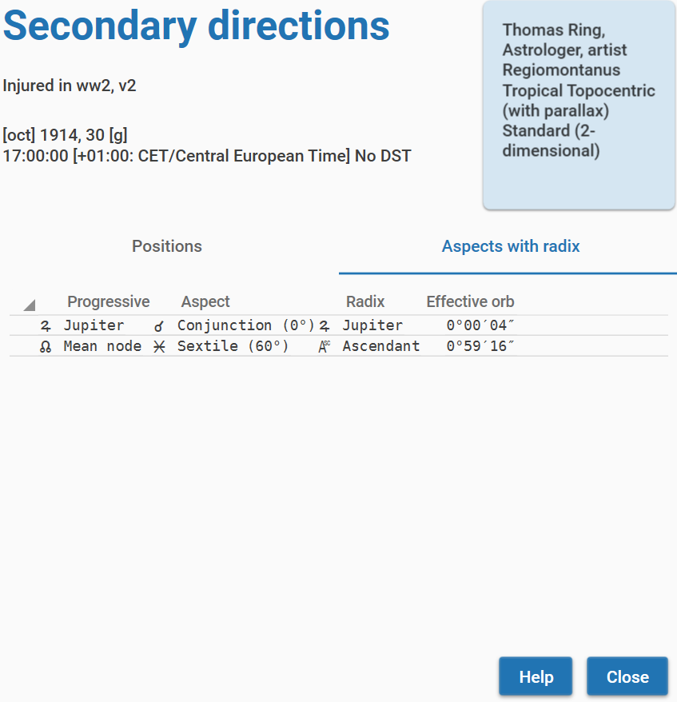
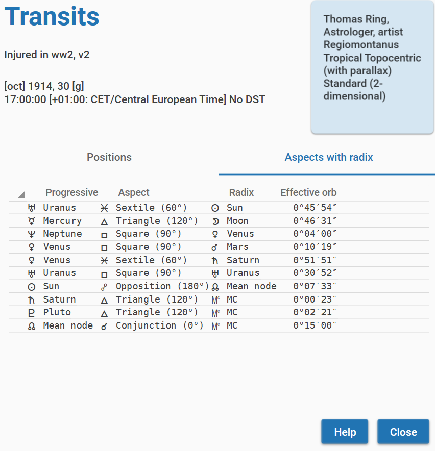
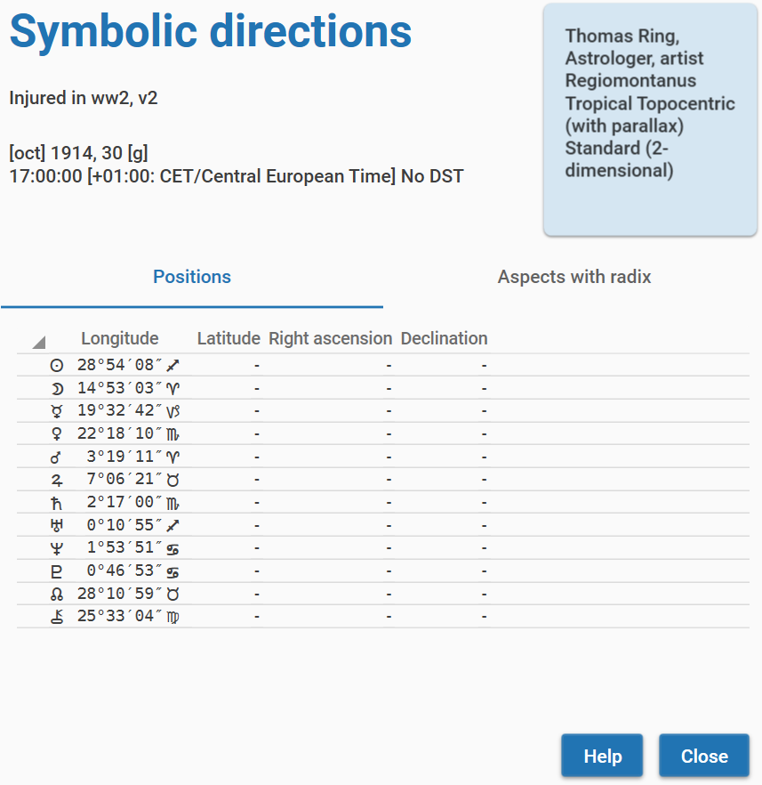

# Enigma 0.4 - Charts

[TOC]

The Charts module supports calculation and analysis of charts.
You can start it by clicking the charts module on the startup screen.
This will open the following screen:

The very first time you start the Charts module, Enigma will not know which charts you want to use.
You first need to create one or more new charts. Enigma will save all new charts automatically in a database.
You can always delete a chart from the database.

If you entered a new chart, the name of the chart will show underneath **Available charts**.
After selecting the chart by clicking on the name, you can use all buttons to the right and all options in the menu.
The database will remember all charts you added, except the charts you deleted.
You can always retrieve an existing chart from the database by searching for it.

The functions of the buttons and the menu partly overlap. You can perform the most common actions with the buttons.
The menu provides the same actions and some additional functionality.

## Create a new chart

To create a new chart, you can click the button **New Chart** or select the menu item **Charts** -> **New Chart**.
This action will open a new screen where you can enter the data:

You need to enter the required data and click the button **Calculate**.
If you made an error, Enigma will show a pop-up with information about what went wrong.
Also, if an error occurs, the underlining of the input field will turn red.

Use the button **Help** for advice on the different fields.

After clicking the button **Calculate**, you will see the newly entered chart in the left column. 
You can select and analyze it.

## Retrieve an existing chart from the database

The main screen for the Charts module shows information about the charts in the database.
You see the last added chart and also the number of charts in the database.

To retrieve a chart from the database, you can click the button **Search Chart** or select the menu item **Charts** -> **Search for Chart**.

In the field _Search argument_, you can enter a (part of) a name, or just leave the field empty.
After clicking the button **Search**, Enigma will show all charts that have the search argument in the name.
It ignores a difference in lowercase or uppercase.
If you did not enter a search argument, you will see all charts from the database.
However, Enigma limits the number of charts to 100.
So you always need to enter a search argument if the number of charts in the database is larger.

Use the button **Help** for more details.

If you select one of the found charts, the button **Select** becomes available.
Click this button to work with the selected chart.
The search window will close and the chart will be available on the main screen for the Charts module.

## Deleting a chart

If you want to delete a chart from the database,you can use the button **Delete** to remove the selected chart. 
Enigma will ask for a confirmation. 
If you confirm, it deletes the data and you can only restore it by reentering the data.

Alternatively, you can use the menu option **Charts** - **Delete chart**.

## Importing charts from PlanetDance

You can import charts from a database in _PlanetDance_ and store them in the Enigma database.  
PlanetDance is a well know free astrology program, created by Jean Cremers. 
After an import, the charts are available for use like any other chart you created.

You have to export the files from PlanetDance first. 
In PlanetDance, select in the menu bar **File – Open**. 
This results in a changed menu with the option _Database_. 
Select **Database – Application – Import export – Excel**. 
Do not use the option _Enigma_ after the Import export option. 
The Enigma option exports to a previous format, used by a predecessor of the current Enigma, called EnigmaDedVM.

In the Excel screen you need to check _Header_ and _Birth info_. 
Checking _Delete old_ makes sense if you want to overwrite previous exports. 
Make sure you do not check any other option.

You need to select the database that you want to export. 
Select in the menu **Export – Export source**. Select the database that you want to export. 
The default database is _planetdance.db_, but you can select another database. Click the **ok**-option in the  menu bar.

Next define where to save the exported charts. Select in the Menu **Export – Export Destination**. 
You can select a folder via the menu option _Browse_. Again click the **ok**-option in the menu bar.

Use the menu option **Separator** to define a character, that separates the different fields with information. 
Make sure this is a semi-colon ‘;’.

To perform the export, select the **Export – Execute**.

You can close PlanetDance now and go back to Enigma.

In the Charts Module, you need to select the menu option **General – Import Charts**.  

This opens a screen where you can select the exported data from PlanetDance via the **Browse** button. 
After selecting the file, click the button **Import**. 
If everything goes well, Enigma confirms that the data has been imported. 
In case of an error you will see a warning. 
Any conflicting lines from the exported data are saved in the file C:\enigma_ar\data\errors.txt

If the import was successful, you can now select the charts via the button **Search Chart** in the Charts main screen.
In the Appendix, you will find a description of the exported data. 
However, you do not need that information to perform a successful import.

## Showing the chart wheel

If you created a new chart, or retrieved a chart from the database, you can now show a graphic chart wheel. 
Select the chart in the left column and click the button **Wheel**, or use the menu option **Charts** - **Show wheel**.
You will see the figure of the chart and the basic information about the chart. Resize the window and the chart will automatically adjust. You do not need to close the window with the wheel to continue. 
It is possible to open wheels for different charts simultaneously. You can also have one or more windows for wheels open and at the same windows for analysis. You will recognize the chart owner as Enigma shows its name in each window.

## Showing the positions of a chart

You can also show the positions for a chart that you selected in the left column. 
Press the button **Positions** or use the menu option **Charts** - **Show positions**.
The screen comprises ecliptical, equatorial and horizontal positions, and the distance, for all celestial bodies. 
You will also see the daily speed of the ecliptical and equatorial coordinates.

Enigma also shows a list of relevant positions for houses. 
This list does not show latitude, as this is always zero for houses.
There is also no daily speed for houses. 

You do not need to close the window with the positions to continue.

A brief description of the column headers:

* Longitude: ecliptical longitude, the usual position in the zodiac.
* Long speed: daily speed in longitude. A negative value means retrogradation.
* Latitude: ecliptical latitude, the deviation from the ecliptic. Positive is north, negative is south.
* Lat speed: daily speed in latitude. A negative value means going from north to south, otherwise the direction is from south to north.
* RA: right ascension, the position at the equator.
* RA speed: daily speed in right ascension.
* Declination: deviation from the equator. Positive is north, negative is south.
* Decl speed: daily speed in declination. A negative value means going from north to south, otherwise the direction is from south to north.
* Distance: the distance from the earth measured in AU (Astronomical Units, the mean distance from Earth to Sun).
* Dist speed: the daily change in the distance.
* Azimuth: the position at the horizon, measured from south toward the west, etc.
* Altitude: the height - or elevation - above the horizon. A negative value shows a celestial point that is underneath the horizon.

## Analysis: aspects

To calculate the aspects for a chart, you can use the menu option **Analysis** - **Aspects**. This results in a window with all aspects.

In the columns you will find:

* Name and glyph for the first point.
* Name and glyph for the aspect.
* Name and glyph for the second point.
* The actual orb.
* A percentage of the exactness of the orb. The percentage is based on the definitions in the configuration. A high percentage shows an exact aspect. 

You can sort the columns by clicking on the header.

You do not need to close the window with aspects to continue.

## Analysis: harmonics

For harmonics, you will use the menu option **Analysis** - **Harmonics**. In the resulting window, you can define a value for a harmonic. The default value is 2. Recalculate the harmonic positions by clicking the button **Calculate**.

You will see the results in three columns:

* A glyph for the celestial point.
* The positions in the radix .
* The positions in the calculated harmonic.

A harmonic number does not need to be an integer. You can also enter floating points as harmonic number.

The harmonic number should be at least 1 (this would repeat the radix positions) and no larger than 100.000.
If you choose such a large number, the results will suffer from a decrease in exactness. 

You do not need to close the window with harmonics to continue.

## Analysis: midpoints

To calculate midpoints, you will use the menu option **Analysis** - **Midpoints**. In the midpoints window you can select one of three dials: 360, 90 or 45 degrees. Enigma automatically recalculates the midpoints if you select another dial.

In the left column, you see all midpoints, indicated by a pair of celestial points and a position. The right column shows the occupied midpoints. In the image, you see Uranus is at the midpoint of Sun and Saturn. The orb is over 24 minutes, which results in an exactness percentage of 74%.

You can sort the columns in the table *Occupied Midpoints* by clicking on the header.

## Analysis: declination diagram

The declination diagram shows an overview of declinations and longitudes.  At the left and the right, the diagram shows the degrees in declination. In most cases the range will be from 30 to -30 (30 North to 30 South). If one of the points has a declination larger than 30 degrees, Enigma will extend that range. The zones at the bottom and the top, indicated by a darker color, indicate where a planet will be Out of Bounds. The outline of the oval form shows the typical declination of the Sun, and other points without latitude.  

Enigma shows the zodiac signs using vertical bars. Horizontal (declination) and vertical (longitude) mark the exact location of the points in the graph.  You can hide the position lines by clicking the checkbox *Hide position lines*.

## Analysis: declination strip

The declination strip shows the declinations, northern declinations at the left and southern declinations at the right. The Out of Bound region has a darker color blue. The diagram also shows the obliquity.

## Analysis: parallels

Use the menu option **Analysis – Declinations – Parallels** for the calculation of parallels. 
The results include contra-parallels. For each parallel, Enigma shows the actual orb and the percentage of exactness.
The default orb is 1°, you change that value in the configuration.

You can sort the columns by clicking on the header.

## Analysis: longitude equivalents

*Longitude equivalents* (LE) have been introduced by Kt. Boehrer. The idea is that you calculate the longitude that corresponds to the declination of a point, whereby you assume that the point has no latitude. For each declination there are two longitudes that qualify, the longitude that is the closest to the real longitude is used.

Points that have no latitude (Sun, lunar nodes, etc.) have a LE that is the same as the longitude.

If a point is Out of Bounds (OOB) there is no corresponding latitude as no degree on the ecliptic has a declination larger than the obliquity of the earth, around 23.5 degrees. In these situations, you can use a *co-declination*. This is a fictive declination. You can find it by calculating the amount of OOB: the degrees in declination that the point is OOB, or, the difference between the declination and the obliquity. You need to subtract the result from the obliquity. An example: if a planet has a declination of 25 degrees, and the obliquity is 23.5 degrees, the difference is 1.5 degrees. The co-declination will be 22 degrees: 23.5 - 1.5.

To calculate the longitude equivalents you need to use the menu option **Analysis - Declinations - Longitude equivalents**. 

In the resulting screen you will see the points and their longitudes and declinations. If a point is OOB, you will find the Co-Declination in the column with the same name. The last column Long. Equiv. contains the values for the Longitude Equivalents.

## Analysis: midpoints in declination

You can calculate midpoints in declination via the menu option **Analysis – Declinations – Decl midpoints**.
Enigma shows the occupied midpoints, gives the actual orb and shows the percentage of exactness.
The default orb is 0.6° (0°36’), you can change that value in the configuration.

You can sort the columns *Orb* and *Exactness* by clicking on the header.

## Progressive techniques

If you select a chart from the start-window for charts, you can click the button **Progressions**.
This will open a window for progressive techniques for the current chart.

For all progressive techniques, you need to define an event.

## Progressive: events

If you created a new chart, the window will not show any events. 
An event in Enigma describes the event in the life of the chart owner. 
You need to define an event only once. The program automatically saves it into the database, so you can reuse it in later sessions.
You can use the same event for all supported progressive techniques.

The start-screen for progressive techniques shows all available events for the chart you are working on.

### Defining an event

Click the button **New event** to define an event. You will see the screen _Define and save event_.The functionality is the same as the data input for a chart. The description of the event can comprise multiple lines.
Click the button **Save** to put the event into the database.

Enigma adds the newly defined event automatically to the list of events.

### Deleting an event
Click the button **Delete** to remove the selected event from the database.

## Progressive: secondary directions

Click the button **Secondary dir** to calculate the secondary directions. You will see a screen with two tabs. The tab _Positions_ shows the positions for the celestial bodies that you defined in the configuration for progressive techniques.
For each body, the programs shows longitude, latitude, right ascension, and declination.

The tab _Aspects with radix_ shows the aspects of the secondary positions with the radix positions and the orb of these aspects.

## Progressive: transits

Click the button **Transits** to calculate the transits. This works the same as with secondary directions. 

There will be a screen with two tabs. The tab _Positions_ shows the positions, conforming to your definitions in the configuration, using longitude, latitude, right ascension and declination.

The tab _Aspects with radix_ shows the aspects of the transit positions with the radix positions and the orb of these aspects.

## Progressive: symbolic directions

Click the button **Symbolic dir** to calculate symbolic directions. Again, you will see two tabs. The tab _Positions_ is different, it only shows the longitude. The values for Latitude, Right ascension and Declination are not available. This is because of the nature of symbolic directions. The progressive position is not an astronomical position but the result of a simple addition. This means that it is not possible to calculate other coordinates than the directed longitude itself.

The tab _Aspects with radix_ shows the aspects between the symbolic positions and the radix positions.

## Progressive: Out of Bounds Calendar

The Out of Bounds Calendar shows the start date and end date for OOB periods. It covers a period of 120 years and calculates the secondary positions, so the moments that a planet goes OOB or In Bounds again is calculated for the first 120 days of life and projected onto the first 120 years of life.

The calendar shows the positions in the radix, followed by a list of OOB related events events in chronological sequence.

Enigma omits points that have no latitude as they cannot be OOB. It also omits hypothetical planets because the declinations for these points are too unsure.

The calculations are based on the true obliquity, the obliquity corrected for nutation. Enigma calculates the obliquity separately for each day. 

Please note that the dates for slow moving planets like Pluto are not exact: there is a margin of a few days. 
