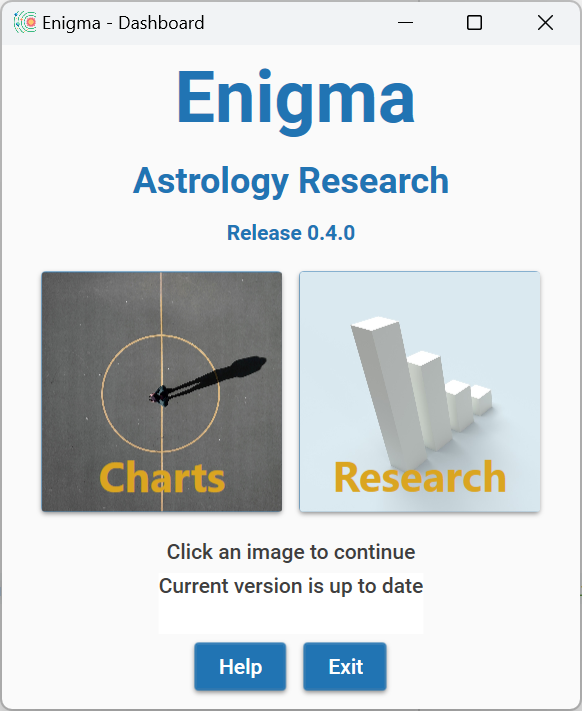

# User Manual Enigma Astrology Research - Release 0.5

[TOC]

## Introduction

Thank you for your interest in Enigma. 
You are about to learn about a program that calculates charts and also supports several types of research into astrology.

You can use it for your astrological calculations. Enigma is accurate and calculates fast, it will produce a chart wheel and perform the most important analysis.

The program also supports several types of research: counting aspects, occupied midpoints, declinations and more. 
And it generates control groups so that you can cancel out artefacts.

Several other releases will follow, and each new release will add more functionality.

Enigma is free: you do not have to pay for it. 
And Enigma is open source: I published all code, and anybody can download it. 
Programmers that want to use my code can do so freely, but only if their own software is also open source.

I hope you enjoy the program!

Jan Kampherbeek.

## General information
Enigma comprises several modules, currently a module for charts and a module for research.
In future releases, I will add more modules.

### User assistance
Enigma tries to help you when using the program. 
It shows on-line help, checks your input, writes details to a log-file and prevents wrong results.

#### On-line help
In almost all windows, Enigma shows a button **Help**. 
If you click this button, the program shows specific information for the current window.
You need to close the help window before you can continue.

#### Input check
Where possible, Enigma checks your input. 
It checks for the correct format and range for date, time and geographical coordinates. 
It also checks if a date is valid and it takes leap years into account while doing so.

If you make an error, Enigma marks the entry with a red underlining. Just correct the input and click again.

Please note that you enter numbers with fractions based on the ‘locality’ (language and other settings) of your computer. 
If you normally use a dot to separate integer and fraction, you also need to use a dot in Enigma. 
The same if your computer expects a comma by default.

#### Log-files
Enigma writes information about its activities to log-files. 
These files are in the folder *c:\enigma_ar\logs*. Each day, the program starts a new log. 
If there are more than 31 log-files, the program deletes the oldest files. 
In case of an error, the log-files can contain important information about the error. 
I might ask you for these log-files if you report an error.

#### Preventing wrong results
Enigma supports almost 30,000 years of planetary calculations, but for some celestial points, this period is much shorter. 
Especially for Chiron, which you cannot calculate before 675 CE.

The Swiss Ephemeris, which takes care of all the calculations in Enigma, does not object if a planet is out of the supported range, it just returns a zero. 
This translates to zero Aries, and you could happily use this point and calculate aspects and midpoints. 
That makes little sense, so Enigma filters the results: if it cannot calculate a celestial point, it will just omit it.

### Starting Enigma

Click the Enigma icon to start the program, or search for Enigma in your windows applications and start it from there.

You will see a window with two images, one labeled *Charts* and one labeled *Research*.

Click an image to go to the corresponding module. 
If you finish working in a module, you will return to this start window and can make another selection.
Both modules of Enigma use the same configuration and the same settings.

The settings define the location of files that Enigma uses. The configuration gives you the opportunity to define how Enigma behaves astrologically: which house system, which planets, aspects, and much more.

#### Checking for new releases
Enigma automatically checks for new releases. If a new release is available, it shows a message in the start window.