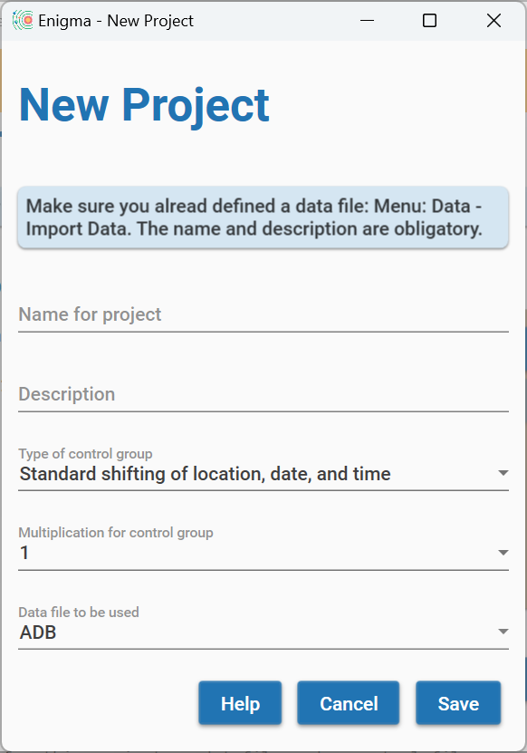
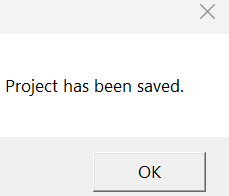
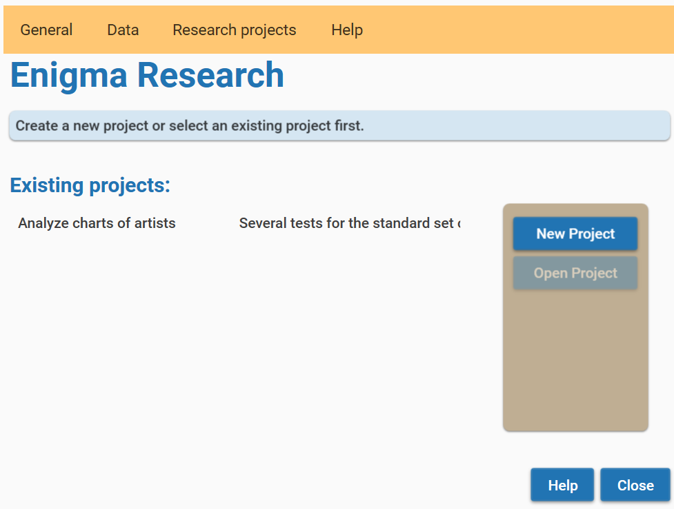
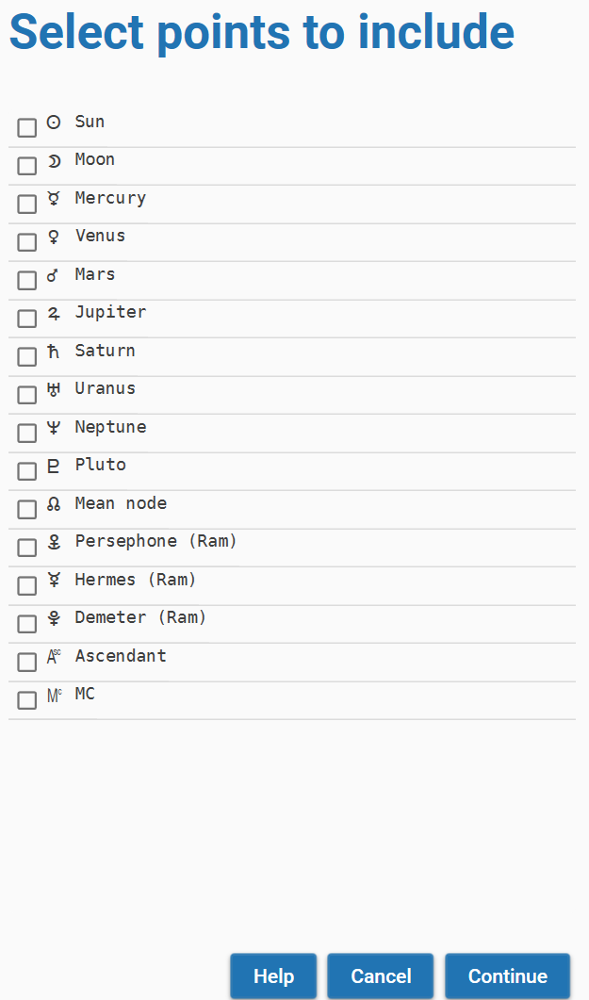
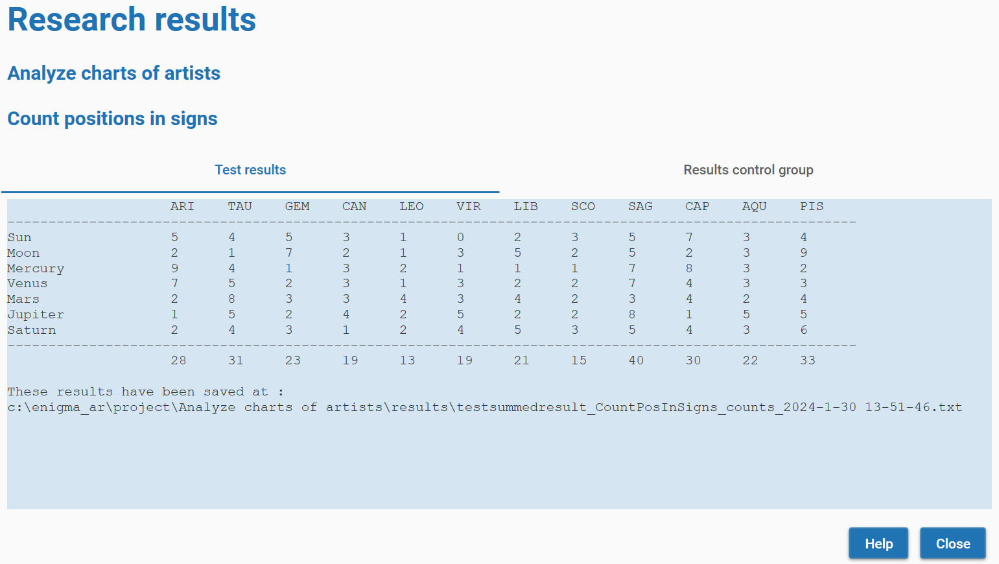

# Enigma 0.5 - Research

[TOC]

To work in the module _Research_, you can click the image _Research_ on the start screen.

This will open the start screen for this module.

Initially, the screen will not show any projects as you need to create these projects first. And a project requires data. A data file needs to have a specific format.
In the _Appendix - Format for data files_ in this manual, you will find a definition for all supported formats.

After reading a data file, Enigma converts it into an internal format.

## Defining data

Before you can define a project, you need to define a data-file. Click the menu option **Data** - **Import data**. You will see the screen _Data File Import_.

Enigma supports two types of data:

- Enigma standard format
- PlanetDance: exported data

Select the type of data. Also select your data file by clicking the button **Browse**. Enter a name for your dataset and click the button **Import**.

Enigma saves all files in the folder c:\enigma_ar\data. It creates a separate folder for each data file. In each of these folders, you will see the sub-folders _csv_ and _json_. These sub-folders contain respectively a copy of the original data and the converted data.

The data folder also contains a file _errors.txt_ that contains descriptions of any error that was encountered.

## Overview of data files

To get an overview of available data files, you can select the menu option **Data** - **Available data sets**.
This results in a screen with a list of the names for the different data files.

## Working with projects

After creating one or more data-files, you can define a project. A project uses only one data-files, but many projects can use the same data-file.

Click the button **New project**. On this screen, you need to define a name for your project and you can add a description. Currently, Enigma supports only one type of control-groups: _Standard shifting of location, date, and time. 

You can define a multiplication for the control group, a factor of 1 (no multiplication), 10, 100 or 1000.

Click the button **Save** to write the project definitions to your file system.

You will see a confirmation pop-up.

The project(s) that you defined will show in the start-screen for research.
You can resize the window if not all text is visible.

## Predefined researches

Select one project on the start-screen for research and the button **Open Project** becomes available. Click this button and you will see the window _Test with project_.

This window contains information about the selected project and shows a scrollable list of available test methods.
Currently, Enigma supports 8 tests. 

You will also see a button **Config**. By clicking this button, you can access the configuration. This can be important, as Enigma uses the existing configuration for all supported tests. If you need to add or remove celestial points, change orbs, etc., you can only do this via the configuration.

Select the test that you want to perform and click the button **Perform Test**. Depending on the type of test, you will need to enter additional information.

### Select celestial points

For all tests, you need to make a selection of the available celestial points. 
Enigma shows all points that you defined in the configuration. 
Depending on the type of test, you need to specify a specific number of points.
Enigma gives a warning if you do not specify enough points. 

### Select details for midpoints

Only if you want to perform the test _Count occupied midpoints_, Enigma will ask for details about these midpoints.

You need to select a dial and define an orb. 
This orb will override the orb in the configuration.

### Select details for harmonics

If you perform the test _Count harmonic conjunctions_, Enigma will ask for details about the harmonics to calculate.
You need to select the harmonic number and the org to be used. This orb will override the orb in the configuration.

### Research results

The results of your test appear in a window _Research results_. This window has two tabs: _Test results_ and _Results control group_. In the first tab, you see the calculated values for your research. At the bottom of the overview, you will see the location where Enigma saves the results. 

The second tab shows the results of the control-group. The background is light-brown while the background of the test data is light-blue. You will also see the location where Enigma stores the data for the control-group results.

## Export data to Excel

It would be useful to use the results of your researches in Excel. This is possible and quite simple.

The research results you see on your screen can also be found on your computer's hard drive. The exact location is shown at the bottom of the overview that Enigma displays. This applies to both the test results and the control group results. The files with test results start with "test," for example, `testsummedresult_CountPosInSigns_counts_2024-8-16 22.47.6`. The corresponding control group results start with "control," for example, `consummedresult_CountPosInSigns_counts_2024-8-16 22.47.6`. In the file name, you can recognize the name and the date and time of the conducted research.

To get the results into Excel, proceed as follows:

1. Start Excel.
2. Open the file with the results. It is located at the location indicated by Enigma with the results. Make sure to select a .txt file and not a .json file.
3. Select the data and click CTRL-C to copy the data. Go to Excel and paste the data into an Excel sheet by clicking CTRL-V (paste). All text is now in one column.
4. Select the data in the Excel sheet.
5. Click on the 'Data' tab in the ribbon menu.
6. Click on the 'Text to Columns' button in the Data Tools group.
7. Select 'Delimited' and click Next.
8. Choose Space as the delimiter. Click Next.
9. Select General as the Column Data Format.
10. Click Finish.

If you want full control over the result, choose 'Fixed width' in option 6. Then you can indicate where you want to place the separation between the columns. Usually, this will not be necessary.
